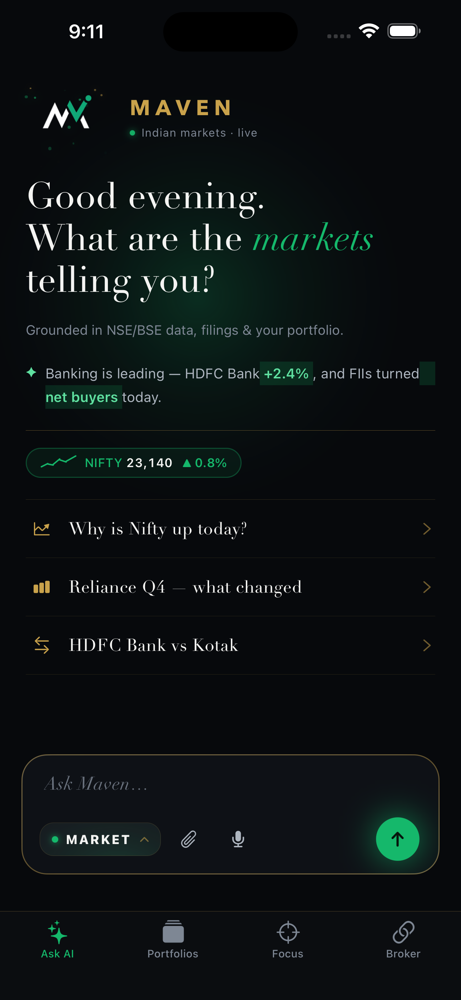
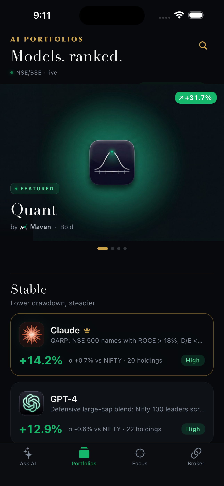
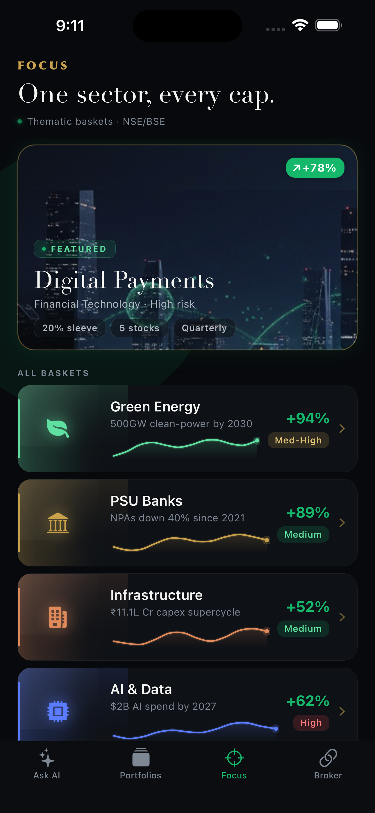
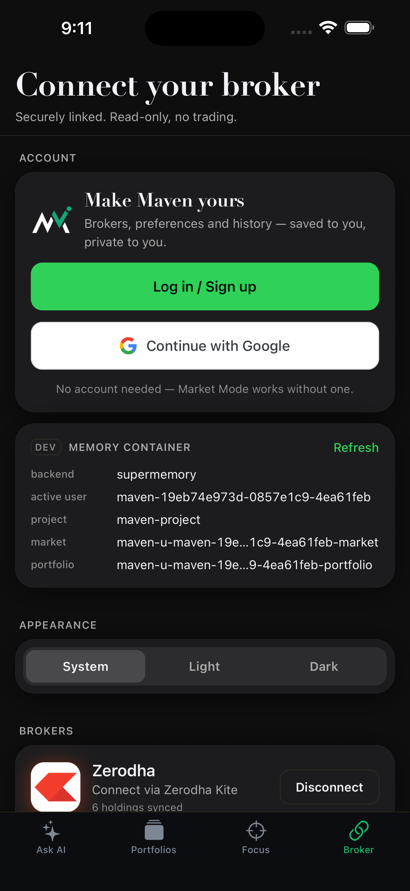

<div align="center">


# MAVEN

**A finance intelligence system for Indian markets — chat, portfolio analytics, and read-only broker data, in one place.**

`NSE / BSE` · `AI-native` · `read-only & SEBI-safe` · `built on Bharat Research Brain`

</div>

---

## What MAVEN is

MAVEN is a premium Indian-market investing copilot. It started as a market-intelligence assistant and is evolving into a broader finance operating system — one that explains the market, reads your real holdings (read-only), and stays strictly inside the descriptive-analytics lane rather than giving investment advice.

The core principle across the whole system: **the language model never invents a number.** Deterministic Python computes every figure, the model only composes prose around it, and a verifier audits the result before it ever reaches the screen.

> **Status:** actively in development. Market intelligence and read-only portfolio analytics are live; AI Portfolios and Focus baskets are built as polished UI on seeded data and are being moved onto the real research engine next. The sections below are explicit about what's shipped vs. what's still in progress.

---

## Screenshots

| Market Mode | Portfolios | Focus |
|:---:|:---:|:---:|
|  |  |  |
| Ask anything about NSE/BSE — grounded, verified answers. | AI model portfolios, ranked _(UI live; engine in progress)_. | Thematic sector baskets _(UI live; engine in progress)_. |

| Broker · Account · Memory |
|:---:|
|  |
| Read-only broker connect, guest-first accounts, and the dev-only memory-container inspector. |

---

## How it works

### 1 · Market Mode — the intelligence layer ✅
A ChatGPT-style assistant scoped to Indian equities. Ask "why is Nifty up today?", "Reliance Q4 — what changed", or "HDFC Bank vs Kotak" and get a grounded answer built from NSE/BSE end-of-day data and filings. Every number is traced back to the source facts; advice, price targets and unverifiable event claims are blocked at the content layer. Specialised lanes cover market briefs, why-a-stock-moved, news, screeners, FII/DII flows and sector heatmaps.

### 2 · Portfolio / Focus Mode — your holdings, described ✅ (descriptive lane)
Connect a broker **read-only** (Zerodha via Kite Connect hosted login; Anand Rathi via issued API keys) — MAVEN never sees your password and never places a trade. It then answers questions about *your* portfolio: health, concentration, red flags, sector exposure, return attribution and benchmark comparison.

This stays deliberately inside **SEBI-safe descriptive analytics** (the statistical-summary lane): it summarises allocation, concentration, exposure, overlap, attribution and risk signals, and **refuses** buy/sell recommendations, allocation calls and price forecasts — pivoting those to "here's how your money is already allocated" instead.

### 3 · Memory — private per user, per mode ✅
Personalization that's isolated at the storage layer, not just in app logic. Every memory read/write requires an authenticated user id, with separate containers for shared project memory, private user memory, Market Mode and Portfolio Mode. One account can never recall another's memory, and Market and Portfolio memory never mix for the same account. Validator-gated (nothing enters memory unless it already passed verification), with a local backend and a Supermemory adapter.

### 4 · Bharat Research Brain — the reasoning core 🚧
The Python research pipeline behind MAVEN: data ingestion → feature engineering → regime detection → structured reasoning → validation, with a curated few-shot example library and a backtest/eval harness. It powers Market Mode today. **The aspiration** is to make it the engine behind AI Portfolios and Focus baskets — using research-backed reasoning, structured market data, scoped memory, feedback loops and validated outputs to make those systems more accurate and consistent over time. That wiring is not built yet; the brain currently serves market intelligence.

---

## Status

Legend: ✅ shipped · 🚧 in progress · ⬜ planned

| Area | Status | What it does | What's left |
|---|---|---|---|
| **Market Mode** | ✅ | Verified NSE/BSE Q&A, briefs, news, screeners, FII/DII, heatmaps | Broaden universe to full NIFTY 500; intraday + fundamentals data |
| **Portfolio / Focus Mode** | ✅ | Read-only broker link + descriptive analytics (health, exposure, attribution, benchmark) | Earnings calendar & richer fundamentals; more brokers |
| **Memory** | ✅ | User- and mode-scoped, validator-gated, local + Supermemory | Auto-populate Portfolio-mode memory once it has an AI writer |
| **Debug tooling** | ✅ | Dev-only memory-container inspector (names + backend, never contents) | — |
| **Authentication** | ✅ | Email/password (PBKDF2 + SQLite), Google hosted-login, per-account data binding | Real Google OAuth credentials; password reset; SecureStore |
| **AI Portfolios** | 🚧 | Polished ranked-leaderboard UI | Real backtested model portfolios on the research engine (currently seeded data) |
| **Focus baskets** | 🚧 | Polished thematic-basket UI | Real basket construction + tracking on the research engine (currently seeded data) |
| **Bharat Research Brain** | 🚧 | Powers Market Mode (ingest → reason → validate) | Wire it to drive AI Portfolios & Focus; feedback loops |
| **Branding** | ✅ | Logo, luxe theme, premium auth page | — |
| **Documentation** | 🚧 | This README + in-code design notes | Public setup guide, architecture deep-dive |

---

## Architecture

```
┌───────────────────────────┐    HTTP (localhost)     ┌─────────────────────────────┐
│  Expo / React Native app   │ ──────────────────────▶ │  Local bridge (serve.py)     │
│  • Ask AI (Market Mode)    │                         │  • /chat, /assess            │
│  • Portfolios · Focus      │                         │  • /portfolio/* (read-only)  │
│  • Broker · Account        │                         │  • /auth/* · /memory/debug   │
└───────────────────────────┘                         └──────────────┬──────────────┘
                                                                      │
                                            ┌─────────────────────────▼──────────────────────────┐
                                            │  Bharat Research Brain  (market-model/, Python)      │
                                            │  ingest → features → regime → reasoning → verifier   │
                                            │  validator-gated memory · few-shot evals             │
                                            └──────────────────────────────────────────────────────┘
```

Secrets (model + data keys) live only in the bridge, never in the app bundle. The app only ever receives already-verified, schema-valid output.

---

## Tech stack

- **App:** Expo (SDK 56) · React Native · TypeScript (strict) · Expo Router · Reanimated · Zustand
- **Research core:** Python · pandas / numpy · pydantic · NSE/BSE ingestion · DeepSeek (reasoning, server-side only)
- **Memory:** local JSONL + Supermemory adapter, container-scoped per tenant
- **Broker:** Zerodha Kite Connect (hosted OAuth) · Anand Rathi (XTS API keys) — read-only, encrypted at rest
- **Testing:** Jest + React Native Testing Library (app) · pytest (research core)

---

## Roadmap

1. **Move AI Portfolios & Focus onto the real engine** — replace seeded data with backtested, research-driven portfolios from Bharat Research Brain.
2. **Deepen the data layer** — full NIFTY 500 universe, earnings calendar, fundamentals.
3. **Close the personalization loop** — populate Portfolio-mode memory; feed signals back into the research core.
4. **Productionize auth** — real Google OAuth, password reset, secure token storage, chat history per account.
5. **More brokers** — Groww, Upstox, Angel One, HDFC Sky (all read-only).

---

## Safety & compliance

- **Read-only broker access** — no trade execution exists anywhere in the codebase.
- **Descriptive analytics only** — portfolio views summarise state; they do not recommend, allocate or forecast.
- **Educational framing** — market analysis, not investment advice.
- **Privacy by construction** — broker tokens encrypted at rest; memory isolated per account at the storage layer.

> Not investment advice. MAVEN is an educational analytics tool. _(Not legal advice — consult a professional before shipping any advice feature.)_

---

## Contact

<!-- TODO(rxhils): replace these placeholders -->
- **Author:** rxhils
- **GitHub:** https://github.com/rxhils
- **Email / X / LinkedIn:** _add links here_

<div align="center">
<sub>Built in public · evolving from market intelligence into a finance operating system.</sub>
</div>
